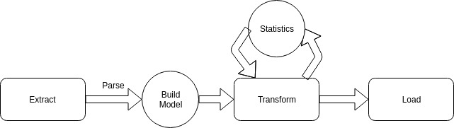

# FastRadius-STLParser
# Overview
This system uses many different built tools to make an ETL config.pipeline

## Dependencies  
- Lombok: 1.18.4
    - Used for maintaining POJO's and removing boilerplate code of getters and setters
    default constructors
- Jackson Code
    - YAML file parsing, used to make runtime configurations for the ETL config.pipeline.
- Apache Libraries
    - Extra utility and access to triples.
- Google Guice
    - Dependency injection for easy factories

## Design
This design features the ability to have multiple different ETL pipelines with different running 
configurations. Each configuration pipeline can be build independent of each other thus if multiple files 
need to be processed then multiple pipelines can be built. I chose to use YAML files to describe the running 
configurations. 


Each pipeline has fixed amount of settings

## Building the pipeline
The pipelines are build from reading in the yaml file that represents the configs for the pipeline. Since 
yaml supports documents within itself. Each yaml file will produce 1 AppConfig object which will contain multiple
PipelineConfigs. For each pipeline config the Pipeline builder will process them and produce the appropriate 
Pipeline Object to be ran later. The PipelineBuilder uses 4 different factories to inject the necessary components 
for each pipeline at runtime. The factories can be built manually or with Google Guice modules for dependency 
injection. 

Currently it is using Guice but can be done with manually building the maps. 

The config YAML files are designed have the following components. If the param is required it will be bolded.   
- **pipelineName**  
    - Name to label particular pipeline  
- **extractType**
    - the key to look up from the extractorFactory.   
- extractConfiguration
    - this is left as optional but with FileExtractor it requires the fileTo read from. It is feasible that this could be optional
- **parseFormat**:
    - this is reserved for parser to be injected for the file.
- **statistics**:
    - list of enabled statistics or analysis to run
- statisticConf
    - extra statistics rules
- **loadType**:
    - list of enabled loaders
- loadConf
    - extra rules for the loaders. 
    
 
    
It is important to note that for design choices the loadType has to align with the keys for the loadConf. 
All the configurations are implementations specific. In that case, the implementation pulls out the appropriate 
information from the configuration maps.

## Running the Pipeline
After the pipelines are built there is a macro of 'runPipeline'. This method will fire the 
extract, transform, and load phases of the pipeline.

### Extract 
In extract, the objective is to hit some endpoint and use the parser set at runtime to convert 
the data to the Model object. The model object is composed of many abstractComponents. After the model is
done being built this concludes the extraction phase.  

Implemented  
FileExtractor: meant to handle FileIO reads for the parser

STLParser: used to generate the Model from an STL File

To add more extractors those would need to be built from an AbstractExtractor. In the new extractor 
it would need a Parser Object to decipher the information from the endpoint it is hitting. Extend the AbstractParser 
to begin building a new one. 

### Transform - Statistics 
After constructing the model, I apply each of the enabled statistics from the yaml to the 
model. I would iterate over the active statistics processes and dump the results 
back into the object. 

Currently Analysis Supports.
- Surface Area: Computes the area for each component then sums up across all components.  
- Box: Finds the max and min with respects to <x,y,z>  and is all the combinations of the triples. 
- Count: counts the amount of components in the model.   

To add another analysis tool it would need to be added to the factory for the mapping process to get into the 
pipeline along with having a concrete class that extends the 'IAnalysis' class.

### Load
The load classes describe where to dump the results from the transform phases to. There are currently only 2 
loaders implemented
- StandardOutLoader - prints the data to stdout
- FileOutLoader - writes the information to a file based on the LoaderConfig map

To add another loader it would need to be added to the loader factory and added have a concrete instance that extends 
'ILoader'

## Running the Program
I chose to make this a gradle project with Java 10. That way I could use a lot of different packages that for 
code simplicity.  To begin running this project you would need to build the jar with the dependencies. 

The following command will quickly build and run all the test cases I have in the project.
```
gradle build
```

The next command on the root directory of the project will build the uber jar with all the dependencies bundled together 
for the project to be run. This command will also build the uber-jar at the projects root directory.
```
gradle fatJar
```

Now that the jar has been built, we can run the project.
```
java -jar STLParser-Uber-1.0-SNAPSHOT.jar <config YAML Path> 
```

I have been using the following command to run the project
```
 java -jar STLParser-Uber-1.0-SNAPSHOT.jar configFiles/moon.yaml 
```

## Design Discussion
Each of the components are fairly modular in their design. If more statistics are asked for then there are more 
dependency on IAnalysis. The user would just have to use more guice binding into the factories to make sure they can be 
injected into the pipeline. So from a design discussion I think there are points that could be simplified but given my 
limited experience with this type of data I cannot simplify it. Therefore, I chose to make it fairly modular. 
 
The design decision to make individual pipes allow for the the pipes to be run in parralel of each other if necessary. 
Since they offer a level of asynchronously execution. 

I allowed for loaders and extractors to be very open ended in the design because they can accomodate either API or 
databases reads and database writes, respectively. Just put in the conf for either case an API key or ssh key. 

### Performance Discussion
If the number of triangles grew relatively large, first I would scale vertically if feasible. That way I could maintain 
the same design. If I knew the stl objects were relative large then I would move towards a distributed storages system. 
In this design there would an extractor program. This would just purely extract the information and back it up to some 
distributed system. In this case, it would be a distributed system file system consisting of serialized java objects or 
distributed databases to be used later. This phase of the pipeline is fairly serial and cannot be parallelized effectively.

After everything is sharded and the model is completed. I would convert each analysis into some form of a MapReduce procedure. 
This will introduce job level parallelism and speed up some of the processing over millions of triangles. It would then 
write to some database or filesystem after being reduced. 

The final loader would be used to redirect the output from the reducers to their respective locations.

This type of computations would be more IO intensive but that should be negligible in this case because it is computing 
time that is more expensive in the overall runtime analysis for really large systems debatably.    
