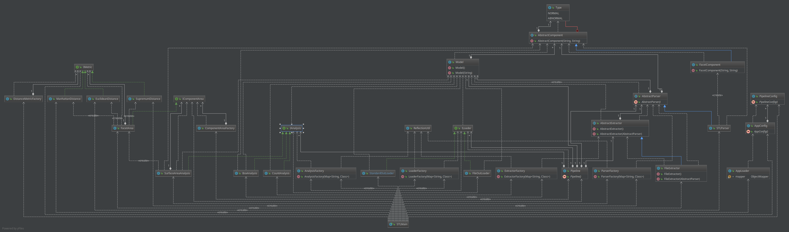

# FastRadius-STLParser
# Overview
This system uses many different built tools to make an ETL pipeline

## Dependencies  
- Lombok: 1.18.4
    - Used for maintaining POJO's and removing boilerplate code of getters and setters
    default constructors
- Jackson Code
    - YAML file parsing, used to make runtime configurations for the ETL pipeline.
- Apache Libraries
    - Extra utility and access to triples.

## New Config File 
- extractType: defines which type of endPoint to hit
- extractConfiguration: String-> Map-> string mapping. Used to define relative file path or in somecases DB 
connection parameters
- parseFormat: defines the string parser for the model to be built with respects
- statistics: list defining which stats to use analysis to perform
- loadType: defines the type of endpoints to using for the ETL pipeline
- loadConfiguration: extra parameters for the loader. This could include but not limited to;

## Design

This design features the ability to have multiple different ETL pipelines with different running 
configurations. Each pipeline can be build independent of each other thus if multiple files 
need to be processed then multiple pipelines can be built. 

### Extract 
In this model extract is reserved for the Extractor Objects and the Parser Objects. With these two
objects a model can be built that describes the 3D model. The parsers are designed to be implementation
specific therefore for each extractor there exist a parser to decipher the information pulled. 
Like many of the objects there is a run-time dependency for a map describing extra params. This can
be used to make API keys or other specification necessary to hit the endpoint to connect the pipeline into. 
For my example with the FileExtractor, it uses a file: "relative stl file". This describes where to read 
from at runtime for the system. 

The parsers are designed to make the model object to perform operations on. After the file is converted into 
a model that is composed of abstract ModelComponents. In my case all the abstractComponents are concrete 
FacetComponents.

### Transform 
For transformation, I iterate over the active statistics processes and dump the results 
back into the object. 
- Surface Area: Computes the area for each component then sums up across all components.  
- Box: Finds the max and min with respects to <x,y,z>  and is all the combinations of the triples. 
- Count: counts the amount of components in the model.   

To add another analysis w